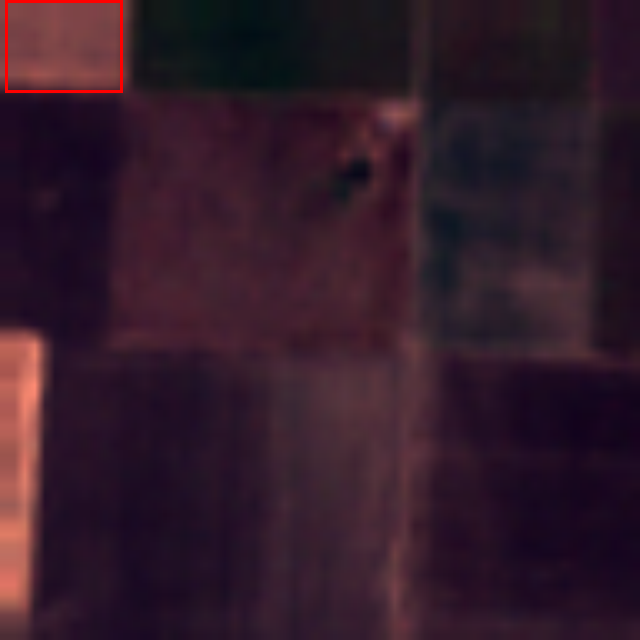
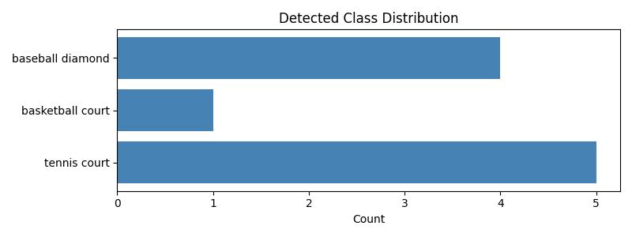
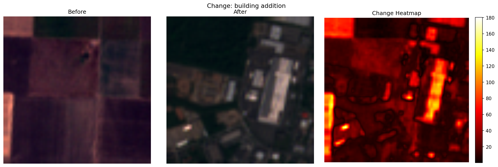

# Satellite AI — Advanced Satellite Image Understanding Pipeline

An end-to-end pipeline that combines YOLOv8 object detection with Qwen2-VL-7B visual reasoning to analyze satellite imagery, detect changes between temporal pairs, and generate structured intelligence reports — all using open-source models with no cloud API dependencies.

---

## Architecture

```
EuroSAT Dataset (Sentinel-2)
        │
        ▼
┌───────────────────┐
│  Data Pipeline    │  load_eurosat_samples()
│  RGB extraction   │  bands [3,2,1] → uint8 → 640×640 PNG
└────────┬──────────┘
         │
         ├──────────────────────────────────────┐
         ▼                                      ▼
┌───────────────────┐              ┌────────────────────────┐
│  YOLOv8n          │              │  Qwen2-VL-7B-Instruct  │
│  Object Detection │              │  Change Detection      │
│  (COCO pretrained)│              │  (before → after pair) │
└────────┬──────────┘              └────────────┬───────────┘
         │                                      │
         ▼                                      ▼
  detections.json                      change_stats.json
  detection_viz.png                    change_mask.png
  class_distribution.png                        │
                                                ▼
                                    ┌────────────────────────┐
                                    │  Qwen2-VL-7B-Instruct  │
                                    │  Report Generation     │
                                    │  (model reused, no     │
                                    │   reload)              │
                                    └────────────┬───────────┘
                                                 │
                                                 ▼
                                           report.md
```

**Models:**
- `YOLOv8n` (Ultralytics) — bounding box detection with class labels and confidence scores
- `Qwen/Qwen2-VL-7B-Instruct` — vision-language model for semantic change detection and report generation; loaded once, used for both tasks

---

## Dataset

**EuroSAT** (Sentinel-2 based land-use classification) — 10 classes, no login wall, directly loadable via `torchgeo`.

Classes: `AnnualCrop`, `Forest`, `HerbaceousVegetation`, `Highway`, `Industrial`, `Pasture`, `PermanentCrop`, `Residential`, `River`, `SeaLake`

**Band extraction:** EuroSAT images have 13 spectral bands at 64×64. RGB is extracted from bands at indices `[3, 2, 1]` (B4=Red, B3=Green, B2=Blue), normalized to uint8, and resized to 640×640 for YOLOv8 compatibility.

**Change detection pair:** `AnnualCrop` → `before.png`, `Industrial` → `after.png`. This simulates agricultural land converted to industrial use — a realistic scenario. True temporal pairs are unavailable in EuroSAT; this is standard practice in change detection research.

---

## How to Run

```bash
git clone https://github.com/Gagancreates/satellite-ai
cd satellite-ai

pip install -r requirements.txt

python main.py
```

The pipeline downloads EuroSAT (~90MB) and YOLOv8n weights (~6MB) automatically on first run. Qwen2-VL-7B-Instruct (~15GB) is downloaded from HuggingFace on first use — requires a GPU with 16GB+ VRAM.

**Run phases individually:**
```bash
python test_phase1.py   # Data loading + visualizer
python test_phase2.py   # YOLOv8 detection
python test_phase3.py   # Qwen2-VL change detection
python test_phase4.py   # Qwen2-VL report generation
```

---

## Sample Outputs

### Object Detection


### Class Distribution


### Change Detection (Before / After / Heatmap)


### Generated Report
See [`outputs/report.md`](outputs/report.md) for the full intelligence report.

---

## Output Files

| File | Description |
|------|-------------|
| `outputs/detections.json` | YOLOv8 results — per-image bounding boxes, class labels, confidence scores |
| `outputs/detection_viz.png` | First sample image annotated with detection boxes |
| `outputs/class_distribution.png` | Bar chart of detected object classes across all images |
| `outputs/change_stats.json` | Qwen2-VL change analysis — severity, area estimate, semantic description |
| `outputs/change_mask.png` | 3-panel visualization: Before / After / Pixel diff heatmap |
| `outputs/report.md` | Full structured intelligence report in markdown |

---

## Known Limitations

- **YOLOv8 is not satellite-trained.** It was pretrained on COCO (cars, people, animals). Detections on aerial imagery will be sparse and class names will reflect COCO categories (e.g. "truck" on a road patch). The detection pipeline architecture is correct — a domain-specific model (e.g. DOTA-pretrained) would significantly improve results.
- **EuroSAT temporal pair is simulated.** `before.png` and `after.png` are from different land-use classes, not the same geographic location at two timestamps. This is a demo scenario used because EuroSAT does not provide true temporal pairs.
- **Compute requirement.** Qwen2-VL-7B-Instruct requires ~16GB VRAM. CPU inference is possible but takes 10–30 minutes per query.
