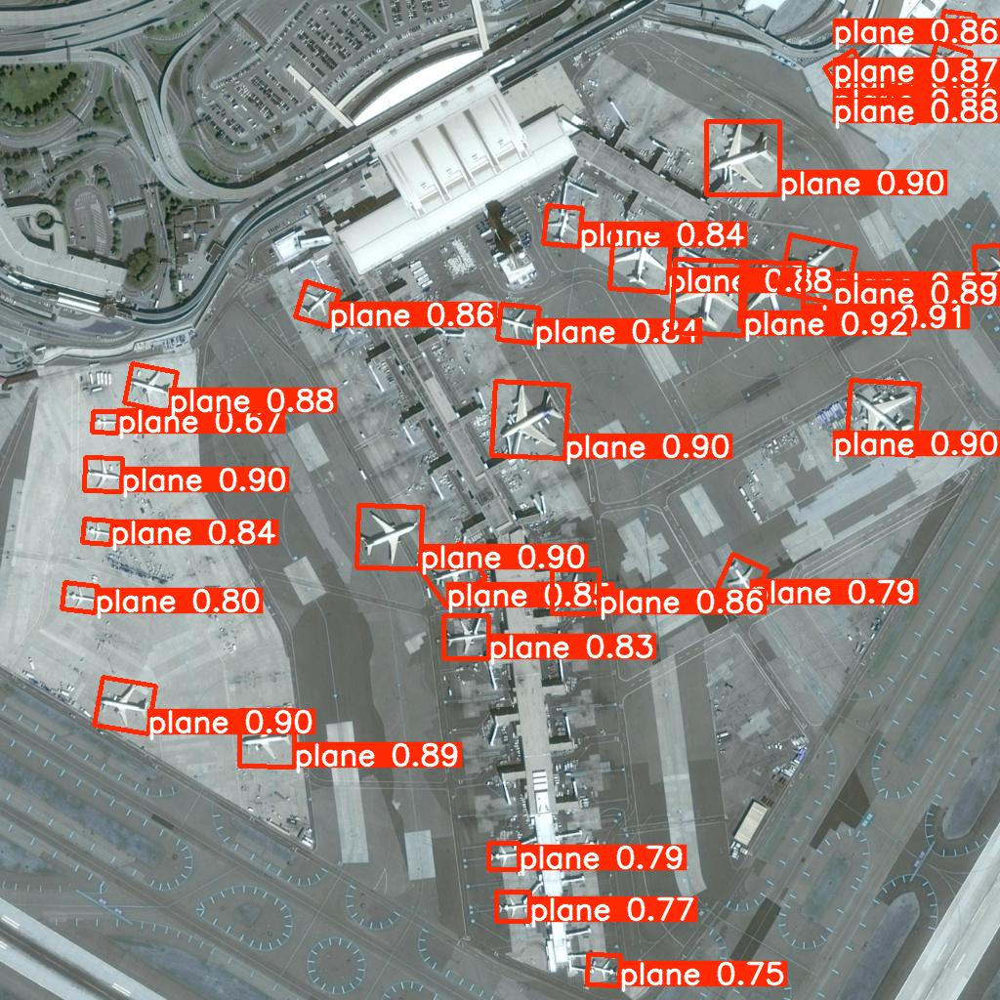

# Satellite AI — Advanced Satellite Image Understanding Pipeline

An end-to-end pipeline that combines YOLOv8-OBB object detection with Qwen2-VL-7B visual reasoning to analyze satellite imagery, detect changes between temporal pairs, and generate structured intelligence reports — all using open-source models with no cloud API dependencies.

---

## Architecture

```
Before/After Satellite Images (Airport)
        │
        ├──────────────────────────────────────┐
        ▼                                      ▼
┌───────────────────┐              ┌────────────────────────┐
│  YOLOv8n-OBB      │              │  Qwen2-VL-7B-Instruct  │
│  Object Detection │              │  Change Detection      │
│  (DOTA pretrained)│              │  (before → after pair) │
│  15 aerial classes│              │                        │
└────────┬──────────┘              └────────────┬───────────┘
         │                                      │
         ▼                                      ▼
  detections.json                      change_stats.json
  annotated.jpg                        change_mask.png
  class_distribution.png                        │
                                                ▼
                                    ┌────────────────────────┐
                                    │  Qwen2-VL-7B-Instruct  │
                                    │  Report Generation     │
                                    │  (model reused, no     │
                                    │   reload)              │
                                    └────────────┬───────────┘
                                                 │
                                                 ▼
                                           report.md
```

**Models:**
- `YOLOv8n-OBB` (Ultralytics) — oriented bounding box detection pretrained on DOTA dataset; 15 aerial classes including plane, ship, vehicle, storage tank, bridge, harbor
- `Qwen/Qwen2-VL-7B-Instruct` — vision-language model for semantic change detection and report generation; loaded once, used for both tasks

---

## Dataset

**Input:** High-resolution satellite imagery of an airport provided as `before.jpg` and `after.jpg` in the repo root.

**Change detection:** The before/after pair simulates temporal change at the same location — Qwen2-VL visually analyzes both images and describes what changed semantically (aircraft presence, activity levels, infrastructure changes).

**For EuroSAT-based testing:** The `test_phase1.py` script uses EuroSAT (Sentinel-2 land-use classification, 10 classes) via `torchgeo` for data pipeline validation. EuroSAT images have 13 spectral bands at 64×64; RGB is extracted from bands `[3, 2, 1]` (B4=Red, B3=Green, B2=Blue), normalized to uint8, and resized to 640×640.

---

## How to Run

```bash
git clone https://github.com/Gagancreates/satellite-ai
cd satellite-ai

pip install -r requirements.txt

python main.py
```

`yolov8n-obb.pt` (~6MB) downloads automatically on first run. Qwen2-VL-7B-Instruct (~15GB) downloads from HuggingFace on first use — requires a GPU with 16GB+ VRAM.

**Run phases individually:**
```bash
python test_phase1.py   # Data loading + visualizer (EuroSAT)
python test_phase2.py   # YOLOv8-OBB detection
python test_phase3.py   # Qwen2-VL change detection
python test_phase4.py   # Qwen2-VL report generation
```

---

## Sample Outputs

### Annotated Detection Image


### Class Distribution


### Change Detection (Before / After / Heatmap)


### Generated Report
See [`outputs/report.md`](outputs/report.md) for the full intelligence report.

---

## Output Files

| File | Description |
|------|-------------|
| `outputs/annotated.jpg` | Satellite image annotated with OBB detection boxes, class labels, confidence scores |
| `outputs/detections.json` | YOLOv8-OBB results — per-image bounding boxes, class labels, confidence scores |
| `outputs/class_distribution.png` | Bar chart of detected object classes across all images |
| `outputs/change_stats.json` | Qwen2-VL change analysis — severity, area estimate, semantic description |
| `outputs/change_mask.png` | 3-panel visualization: Before / After / Pixel diff heatmap |
| `outputs/report.md` | Full structured intelligence report in markdown |

---

## Known Limitations

- **YOLOv8-OBB is pretrained on DOTA** — a large-scale aerial dataset. Detection quality depends on image resolution and similarity to DOTA training data. Works well on high-resolution airport/urban imagery.
- **Change detection pair is not strictly temporal.** Before/after images may differ in resolution or acquisition angle. Qwen2-VL performs semantic reasoning rather than pixel-level diff, making it robust to these variations.
- **Compute requirement.** Qwen2-VL-7B-Instruct requires ~16GB VRAM. CPU inference is possible but takes 10–30 minutes per query.
